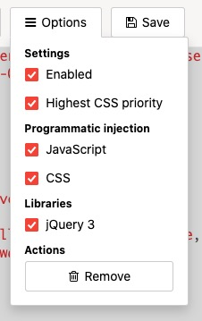
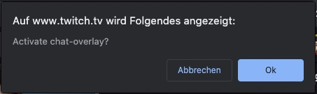

# twitch-streamer-chat-overlay
A chat messsage overlay for twitch streamer.

## Installation

Install the [User JavaScript and CSS](https://chrome.google.com/webstore/detail/user-javascript-and-css/nbhcbdghjpllgmfilhnhkllmkecfmpld/related) browser extension.

Go to your twitch page twitch.com/yourChannel.

Copy the Code of twitch.css into the CSS Part and the Code of twitch.js into the JS Part of the Plugin.

Inside the Plugin activate these settings:

Click the "Save" Button.

## Run script

Reload your page.

You should see a confirm box -> click "OK".

## Credits
Thanks to https://github.com/aaronpk/youtube-chat-overlay for the Idea. :-)
